# Chrome Web Store Publication Readiness Report

**Extension:** nufftabs v1.0.0  
**Date:** 2026-02-12  
**Scope:** Full codebase review against CWS/MV3 policies

---

## A) Executive Summary

### Overall Readiness Verdict: **Nearly Ready**

The extension is well-architected, minimal in scope, and largely CWS-compliant. Permissions are justified, there is no remote code execution, and data stays local. A small number of issues—mostly cosmetic and policy hygiene—should be addressed before submission.

### Top 5 Risks That Could Cause Rejection or Review Delays

| # | Risk | Severity |
|---|------|----------|
| 1 | **Google Fonts loaded from external CDN** — both HTML pages fetch fonts from `fonts.googleapis.com`. This is an undeclared network request, contradicts the privacy policy ("does not make network requests"), and may trigger CSP review or data-handling questions. | **High** |
| 2 | **`public/wxt.svg` (WXT boilerplate logo) shipped in build** — an unused asset from the WXT scaffold will be in the packaged zip. Not a blocker, but CWS reviewers may question unrelated files. | **Medium** |
| 3 | **No `version` in `wxt.config.ts` manifest** — version is only in `package.json`. WXT may or may not copy it. If the generated manifest lacks a `version` field, CWS will reject the upload. | **Medium** |
| 4 | **Privacy policy URL not embedded in manifest** — CWS recommends (and sometimes requires) a `homepage_url` or link to the privacy policy inside the listing. The policy exists in-repo but may not be web-hosted. | **Medium** |
| 5 | **Store listing assets not prepared** — no screenshots, promotional tiles, or store description draft exist in the repo. These are required for submission. | **Medium** |

### What to Fix First (Ordered)

1. Bundle Google Fonts locally (or remove) — eliminates the privacy contradiction and network concern.
2. Verify `version` appears in generated manifest — build and inspect `.output/chrome-mv3/manifest.json`.
3. Remove `public/wxt.svg` from the project.
4. Host the privacy policy at a public URL and reference it in the CWS listing.
5. Prepare store listing assets (screenshots, description, category).

---

## B) Manifest & MV3 Compliance

### MV3 Correctness Checklist

| Item | Status | Notes |
|------|--------|-------|
| `manifest_version: 3` | ✅ | WXT generates this for Chrome target |
| Service worker (background) | ✅ | `entrypoints/background/index.ts` uses `defineBackground()` — WXT wires this as MV3 service worker |
| `action` field | ✅ | Configured in [wxt.config.ts](file:///Users/vp-dc/Documents/GitHub/nufftabs/wxt.config.ts) with title + icons |
| `permissions` | ✅ | `["tabs", "storage"]` — minimal |
| `host_permissions` | ✅ | None requested — correct |
| `content_security_policy` | ✅ | Not set — defaults are fine (no inline scripts) |
| `options_ui` | ✅ | `open_in_tab: true` — correct for MV3 |
| Icons (all sizes) | ✅ | 16, 19, 32, 38, 48, 96, 128 PNG provided |

### Permission Justification

| Permission | Justified? | Rationale |
|------------|-----------|-----------|
| `tabs` | ✅ Yes | Required to query, create, update, remove, and discard tabs/windows. Core to condensing and restoring tabs. |
| `storage` | ✅ Yes | Required for `chrome.storage.local` to persist tab groups and settings. |

- **No host permissions** — correct; the extension does not inject content scripts or access page content.
- **No risky permissions** — no `webRequest`, `management`, `debugger`, `downloads`, etc.

### Remote Code Execution / Dynamic Injection Check

| Vector | Found? | Evidence |
|--------|--------|----------|
| `eval()` | ❌ None | Grep confirmed |
| `innerHTML` | ❌ None | Grep confirmed |
| `outerHTML` assignment | ❌ None | Grep confirmed |
| `insertAdjacentHTML` | ❌ None | Grep confirmed |
| `document.write` | ❌ None | Grep confirmed |
| `new Function()` | ❌ None | Grep confirmed |
| Dynamic `<script>` injection | ❌ None | All scripts are static module imports |
| Fetch/XHR to remote endpoints | ❌ None | No fetch/XHR calls in source (but see Google Fonts issue below) |

> [!IMPORTANT]
> The only external network call is the Google Fonts `<link>` in both HTML files. This is not "remote code execution" but is an external resource fetch that should be addressed.

---

## C) Security Review

### Data Flow Analysis

```mermaid
graph LR
    A["User clicks action icon"] --> B["Background: query tabs"]
    B --> C["Background: filter eligible tabs"]
    C --> D["Background: save to chrome.storage.local"]
    D --> E["Background: close tabs"]
    E --> F["Background: focus/create list tab"]
    F --> G["List UI: read from chrome.storage.local"]
    G --> H["List UI: render with createElement/textContent"]
    H --> I["User actions: restore/delete/import/export"]
    I --> J["List UI: write to chrome.storage.local"]
```



- **Input:** Tab URLs and titles from `chrome.tabs.query()`, user-pasted JSON/OneTab text
- **Storage:** `chrome.storage.local` only — never leaves the device
- **Rendering:** All DOM construction uses safe APIs (`document.createElement`, `element.textContent`, `element.setAttribute`)
- **Export:** JSON stringified to textarea → clipboard (`navigator.clipboard.writeText`) and Blob download

### Injection / XSS Risk Assessment

| Area | Risk | Analysis |
|------|------|----------|
| Tab title/URL rendering | **None** | Uses `textContent` exclusively ([index.ts:183-187](file:///Users/vp-dc/Documents/GitHub/nufftabs/entrypoints/nufftabs/index.ts#L183-L187)) |
| SVG icon creation | **None** | Uses `createElementNS` with hardcoded attribute values ([index.ts:59-71](file:///Users/vp-dc/Documents/GitHub/nufftabs/entrypoints/nufftabs/index.ts#L59-L71)) |
| JSON import | **None** | `JSON.parse` → strict normalization with type checks ([list.ts:59-84](file:///Users/vp-dc/Documents/GitHub/nufftabs/entrypoints/nufftabs/list.ts#L59-L84)) |
| OneTab import | **Low** | URL scheme validated via allowlist regex (`http/https/file/chrome/chrome-extension`). Parsed text is only stored, never injected into DOM as HTML ([onetab_import.ts:3-4](file:///Users/vp-dc/Documents/GitHub/nufftabs/entrypoints/nufftabs/onetab_import.ts#L3-L4)) |
| URL handling in restore | **None** | URLs passed directly to `chrome.tabs.create({ url })` — Chrome handles validation |
| Settings page | **None** | Uses form elements and `textContent` only |

### API Usage Review

| API | Usage | Risk |
|-----|-------|------|
| `chrome.tabs.query/create/update/remove` | Core condense/restore behavior | Low — standard tab management |
| `chrome.tabs.discard` | Memory-saving restore feature | Low — documented Chrome API |
| `chrome.windows.create/update` | Restore all + window focus | Low |
| `chrome.storage.local` | All data persistence | Low — local only |
| `chrome.runtime.getURL` | Resolve list page URL | None |
| `navigator.clipboard.writeText` | Export copy-to-clipboard | Low — requires user gesture |
| `URL.createObjectURL` / `Blob` | Export file download | None |

### Secrets / Sensitive Artifacts

- ❌ No API keys, tokens, or credentials in the repo
- ❌ No `.env` files
- ❌ No hardcoded URLs to external services (except Google Fonts)
- ❌ No build outputs (`.output/`) committed
- ✅ `.gitignore` correctly excludes `.output`, `node_modules`, `coverage`, `test-results`

---

## D) Privacy & Data Handling (CWS "Data Safety" Readiness)

### What User Data Is Accessed / Processed

| Data | How accessed | Purpose |
|------|-------------|---------|
| Tab URLs | `chrome.tabs.query()` | Saved for later restore |
| Tab titles | `chrome.tabs.query()` | Display in list UI |
| Window IDs | `chrome.tabs.query()` | Group key generation, window reuse logic |
| User-pasted text | Textarea input | JSON & OneTab import |

### Storage and Retention

| Aspect | Details |
|--------|---------|
| Storage location | `chrome.storage.local` — on-device only |
| Sync | Not synced — data does not leave the device |
| Retention | Until user deletes/restores tabs or clears extension data |
| User controls | Delete single tab, delete group, "Import (replace)" to overwrite, uninstall extension |
| Export | User-initiated JSON download + clipboard copy |

### Privacy Policy Assessment

- ✅ **Present:** [PRIVACY_POLICY.md](file:///Users/vp-dc/Documents/GitHub/nufftabs/PRIVACY_POLICY.md) exists in repo
- ✅ **Accurate:** Correctly describes data processed, local-only storage, no third-party sharing, no analytics

> [!WARNING]
> **Contradiction:** The privacy policy states *"The extension does not make network requests for its core functionality"* — but the HTML pages load Google Fonts from `fonts.googleapis.com`. This is technically a network request on every page load that sends the user's IP to Google. This must be reconciled (either bundle fonts locally or update the privacy policy disclosure).

### CWS Data Safety Form Guidance

When filling out the CWS listing Data Safety section:

- **"Does your extension collect or use any of the following?"**
  - ✅ Check "Web history" → sub-item "URLs" — because the extension reads and stores tab URLs
  - Do NOT check "Personal communications," "Authentication info," etc.

- **"Is data transferred off the user's device?"**
  - Currently: **Yes, via Google Fonts** (IP address sent to Google's CDN). Fix by bundling fonts locally, then answer **No**.
  - After fix: **No** — all data stays in `chrome.storage.local`

- **Disclosure text suggestion:**
  > "nufftabs reads tab URLs and titles to save them into a local list. Data is stored on-device only and is never transmitted to any server. Users can delete saved data at any time."

### Privacy Policy Hosting

> [!IMPORTANT]
> CWS requires a **publicly accessible URL** for the privacy policy if the extension handles user data. The in-repo Markdown file is not sufficient. Consider hosting it as a GitHub Pages site or linking to the raw GitHub file.

---

## E) Build / Packaging / Submission Hygiene

### What to Submit

The CWS submission zip should be the output of:
```bash
pnpm zip
```
This produces a zip in `.output/` containing the contents of `.output/chrome-mv3/` (the production MV3 build).

### Dev Artifacts Check

| Item | Status | Notes |
|------|--------|-------|
| `.output/` committed | ✅ Clean | Correctly gitignored |
| `node_modules/` committed | ✅ Clean | Correctly gitignored |
| Source maps in build | ⚠️ **Check** | Run `pnpm build` and verify no `.map` files in `.output/chrome-mv3/` (WXT defaults may vary) |
| `localhost` permissions | ✅ Clean | None declared |
| `console.log` in source | ✅ Clean | No console statements in any entrypoint code |
| Test files in build | ✅ Clean | Tests are in `tests/` (not `entrypoints/`), so WXT won't include them |
| `.wxt/` | ✅ Clean | Correctly gitignored |

### Files That Should NOT Be in the Zip

| File | Risk | Action Needed |
|------|------|--------------|
| `public/wxt.svg` | **Medium** | WXT copies everything in `public/` into the build output. This WXT boilerplate puzzle-piece SVG has nothing to do with nufftabs and will be shipped. **Remove it.** |

### Recommended Release Workflow

```bash
# 1. Clean build
rm -rf .output

# 2. Production build
pnpm build

# 3. Inspect the generated manifest
cat .output/chrome-mv3/manifest.json
# Verify: version, permissions, service_worker, icons, options_page

# 4. Verify no source maps
find .output/chrome-mv3 -name "*.map"
# Expected: no results

# 5. Verify no unexpected files
ls -la .output/chrome-mv3/
# Should contain: manifest.json, icon/, JS bundles, HTML pages, CSS

# 6. Create the zip
pnpm zip
# Output: .output/nufftabs-X.X.X-chrome.zip (or similar)

# 7. Size check (CWS budget: generally fine under 10MB; CI enforces 1MB)
du -h .output/*.zip
```

### Manifest Version Field

> [!WARNING]
> The `wxt.config.ts` manifest block does not set `version`. WXT *may* pull it from `package.json` (`1.0.0`), but this should be verified. Run `pnpm build` and confirm the generated `manifest.json` contains `"version": "1.0.0"`. If missing, add `version: '1.0.0'` to the manifest block in `wxt.config.ts`.

---

## F) UX / Store Listing Readiness

### Screenshots to Emphasize

1. **Condense action** — show before (many tabs) and after (list page with saved groups)
2. **List page UI** — show grouped tabs with restore/delete controls visible
3. **Restore flow** — demonstrate restoring a single tab
4. **Export/Import panel** — show the JSON export/import panel
5. **Options page** — show the settings (theme, exclude pinned, batch size, memory saving)
6. **Dark mode** — show the dark theme variant of the list page

### Store Description Points

- Condense all open tabs with one click
- Tabs saved locally — never leaves your device
- Restore individually or all at once
- Import/export JSON backups
- Import from OneTab
- Customizable: exclude pinned tabs, batch restore size, memory-saving mode
- Dark mode / light mode / system theme
- No tracking, no analytics, no network requests

### Required Disclosures

- **Justification for `tabs` permission:** "nufftabs reads tab URLs and titles to save and restore your tabs. This is the core functionality of the extension."
- **Justification for `storage` permission:** "Saved tab groups and settings are stored locally on your device using Chrome's storage API."

### Common Reviewer Concerns for Tab Managers

| Concern | How This Extension Addresses It |
|---------|-------------------------------|
| "Why does it need `tabs`?" | Core feature — cannot function without querying/creating/closing tabs. Permission justification text above. |
| "Does it track browsing?" | No. Data stays in `chrome.storage.local`. No network requests (after fixing Google Fonts). |
| "Could it exfiltrate URLs?" | No `fetch`/`XHR` calls. No host permissions. No content scripts. URLs only go into local storage. |
| "Is there hidden functionality?" | Clean, auditable codebase. No minified third-party libraries. WXT build is transparent. |

---

## G) Action Plan (Prioritized TODO)

### Blocker

| # | Issue | Evidence | Expected Outcome |
|---|-------|----------|-----------------|
| — | No blockers identified | — | — |

### High

| # | Issue | Evidence | Expected Outcome |
|---|-------|----------|-----------------|
| 1 | **Bundle Google Fonts locally** | [nufftabs/index.html:7-9](file:///Users/vp-dc/Documents/GitHub/nufftabs/entrypoints/nufftabs/index.html#L7-L9), [options/index.html:8-10](file:///Users/vp-dc/Documents/GitHub/nufftabs/entrypoints/options/index.html#L8-L10) — external `<link>` tags to `fonts.googleapis.com` | Download Roboto font files into `public/fonts/`, update CSS `@font-face` declarations, remove external `<link>` tags. **Verify:** no network requests to external domains visible in DevTools Network tab when pages load. |
| 2 | **Update privacy policy** | [PRIVACY_POLICY.md:32](file:///Users/vp-dc/Documents/GitHub/nufftabs/PRIVACY_POLICY.md#L32) — "does not make network requests" is inaccurate until fonts are bundled | After bundling fonts, the statement becomes accurate. If fonts are NOT bundled, add a disclosure about `fonts.googleapis.com`. **Verify:** privacy policy accurately reflects all network behavior. |
| 3 | **Verify `version` in generated manifest** | [wxt.config.ts](file:///Users/vp-dc/Documents/GitHub/nufftabs/wxt.config.ts) — no `version` in manifest config | Run `pnpm build && cat .output/chrome-mv3/manifest.json` and confirm version is present. If missing, add `version: '1.0.0'` to the manifest block. **Verify:** `manifest.json` contains `"version": "1.0.0"`. |

### Medium

| # | Issue | Evidence | Expected Outcome |
|---|-------|----------|-----------------|
| 4 | **Remove `public/wxt.svg`** | [public/wxt.svg](file:///Users/vp-dc/Documents/GitHub/nufftabs/public/wxt.svg) — WXT boilerplate, not used by the extension | Delete the file. **Verify:** `ls .output/chrome-mv3/` after build shows no `wxt.svg`. |
| 5 | **Host privacy policy at a public URL** | PRIVACY_POLICY.md exists only in repo | Publish via GitHub Pages, raw.githubusercontent.com, or a static site. Add the URL to the CWS listing. **Verify:** URL is accessible and content matches the repo file. |
| 6 | **Confirm no source maps in production build** | WXT config does not explicitly disable source maps | Run `pnpm build && find .output/chrome-mv3 -name '*.map'`. **Verify:** no `.map` files found. |
| 7 | **Prepare store listing assets** | No screenshots or description draft in repo | Create 1280×800 or 640×400 screenshots of key flows (condense, list, restore, options, dark mode). Write a CWS description. **Verify:** assets exist and meet CWS size requirements. |

### Low

| # | Issue | Evidence | Expected Outcome |
|---|-------|----------|-----------------|
| 8 | **Add `theme` to settings disclosed in privacy policy** | [PRIVACY_POLICY.md:13](file:///Users/vp-dc/Documents/GitHub/nufftabs/PRIVACY_POLICY.md#L13) — lists settings but omits `theme` | Add "theme" to the settings list in privacy policy. **Verify:** all persisted settings fields are listed. |
| 9 | **Consider adding `offline_enabled: true` to manifest** | Manifest enhancement — the extension works fully offline | Add to `wxt.config.ts` manifest block. **Verify:** appears in generated manifest. |
| 10 | **OneTab import allows `chrome://` and `chrome-extension://` URLs** | [onetab_import.ts:4](file:///Users/vp-dc/Documents/GitHub/nufftabs/entrypoints/nufftabs/onetab_import.ts#L4) — regex includes `chrome` and `chrome-extension` schemes | These URLs cannot be opened by `chrome.tabs.create()` anyway and will silently fail on restore. Consider filtering to `http/https/file` only during import, or document the limitation. **Verify:** importing a OneTab line with `chrome://settings` either skips it or handles gracefully on restore. |
